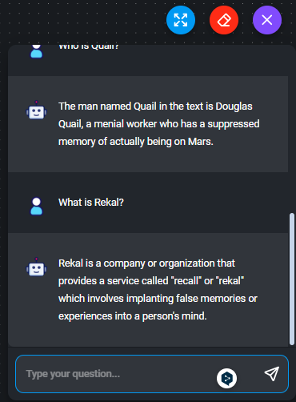

# Chatbot de Respuestas basadas en Archivos con Flowise

Este README documenta un proyecto de desarrollo de un chatbot capaz de proporcionar respuestas basadas en el contenido de archivos de texto (txt o pdf) utilizando la herramienta Flowise. A continuación, se presenta una descripción del proyecto y se detallan los pasos para llevar a cabo su implementación.

## Índice
1. [Consideraciones generales](#1-consideraciones-generales)
2. [Preámbulo](#2-preámbulo)
3. [Resumen del proyecto](#3-resumen-del-proyecto)
4. [Objetivos de aprendizaje](#4-objetivos-de-aprendizaje)
5. [Criterios de aceptación](#5-criterios-de-aceptación)
6. [Implementación paso a paso](#6-implementación-paso-a-paso)
7. [Recursos](#7-recursos)

## 1. Consideraciones generales
- Este proyecto se realizó de manera individual.

## 2. Preámbulo
En la actualidad, la inteligencia artificial (IA) desempeña un papel crucial en diversos aspectos de nuestra vida. La IA no se limita al ámbito de la tecnología de la información, sino que también ha avanzado en áreas donde los algoritmos "inteligentes" pueden comprender y responder de manera similar a los seres humanos. Estos algoritmos pueden redactar textos, organizar información y mantener conversaciones coherentes.

La capacidad de dirigir eficazmente la IA y comprender las herramientas disponibles es una habilidad poderosa, ya que permite aprovechar al máximo sus capacidades para automatizar tareas, optimizar procesos, generar contenido de alta calidad, analizar datos y mucho más.

## 3. Resumen del proyecto
Se creo un chatflow utilizando las herramientas disponibles en Flowise para habilitar esta capacidad en un chatbot.

## 4. Objetivos de aprendizaje
Este proyecto esta enfocado a alcanzar los siguientes objetivos de aprendizaje:

- Familiarizarse con los conceptos clave relacionados con la Inteligencia Artificial Generativa.
- Trabajar con Flowise para implementar soluciones de IA que se expongan a través de una API. Flowise se basa en LangChain, por lo que también se comprenden los conceptos fundamentales de esta herramienta.

## 5. Criterios de aceptación
Para garantizar el éxito del proyecto, se tomaron los siguientes criterios de aceptación:

- Configurar el chatflow de manera que pueda cargar al menos 1 archivo de texto en formato txt o pdf.
- Utilizar el modelo gpt-3.5-turbo para la generación de respuestas.
- El chatbot debe ser capaz de responder preguntas utilizando la información contenida en los archivos cargados.
- Las GitHub Actions deben ejecutarse sin errores.
- Utilizar al menos los siguientes nodos en el chatflow:
  - Conversational Retrieval QA Chain
  - Document Loaders
  - Text Splitters
  - Vector Stores
  - Embeddings
  - Memory
  - Conversational Agent

## 6. Implementación paso a paso
A continuación, se detallan los pasos para llevar a cabo la implementación del proyecto:

### Paso 1: Instalar Flowise
Se instaló Flowise globalmente 
### Paso 2: Configurar el chatflow
- Se configuró el chatflow de acuerdo con las herramientas y componentes específicos de Flowise. configurando la conexión con la API de OpenAI utilizando el modelo `gpt-3.5-turbo`.

### Paso 3: Implementar la lógica del chatbot
- Se implementó la lógica del chatbot para procesar y analizar el contenido de los archivos cargados.

### Paso 4: Validar la funcionalidad
- Se validó que el chatbot puede responder preguntas utilizando la información de los archivos cargados y que cumple con los criterios de aceptación establecidos.

### Paso 5: Ejecutar test de forma local y GitHub Actions
- Se verificó que todas las pruebas se ejecuten con éxito y se configuró el flujo de trabajo en GitHub Actions para ejecutar las pruebas de tu proyecto de forma automática.

## 7. Recursos
Recursos utilizados para la realización del chatbot
- [Serie de tutoriales en youtube (inglés)](https://www.youtube.com/watch?v=tD6fwQyUIJE&list=PL4HikwTaYE0HDOuXMm5sU6DH6_ZrHBLSJ)
- [Webscrap QnA](https://docs.flowiseai.com/use-cases/web-scrape-qna)